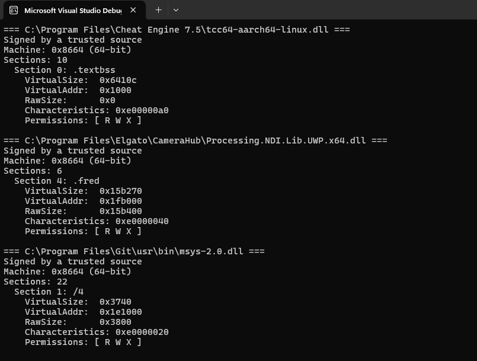

# Legit-DLL-Finder

The purpose of this program is to recursively search a directory for DLLs that have a Read Write and Execute sections
and are also with an embedded signature. If such sections are found they are printed on the console.

Example output:


Example how you can add a directory as a startup param for easy development:


You can start the program with ```<name> <root dir for recursive search>```

Example: ```dll-searcher.exe C:``` will search the whole C: drive.
